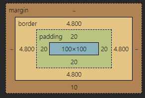

# CSS 스타일링

CSS를 스타일링하기 위해 기본적인 개념들을 알아보자.

## Box Model

div 태그를 사용하여 width(100px)와 height(100px)를 지정하면 기본적으로 Box Model이 생성된다.

- 그런데 `box-sizing: content-box;`을 지정하게 되면 padding과 border를 넣을시 내가 의도한 박스 사이즈보다 더 크게 된다.
- 이를 방지하기 위해 `box-sizing: border-box;`를 사용하면 된다. 이 속성을 사용하면 padding과 border를 넣어도 박스 사이즈를 내가 지정한 width(100px)와 height(100px)로 유지할 수 있게 된다.
- 실무에서는 대부분 `box-sizing: border-box;` 속성을 사용한다.

## Border vs Outline

| border

- 실무에서는 `box-sizing: border-box;`를 주로 사용하는데 border 속성을 사용하게 되면 테두리가 안쪽으로 생긴다.
- 이렇게 하면 width와 height를 내가 지정한 크기로 유지할 수 있다.

| outline

- 하지만 테두리를 바깥쪽으로 생기게 하고 싶을 때가 있는데 이 때는 outline 속성을 사용하면 된다.
- 바깥쪽에 테두리가 생기기 때문에 width와 height가 테두리 크기만큼 늘어나게 된다.
