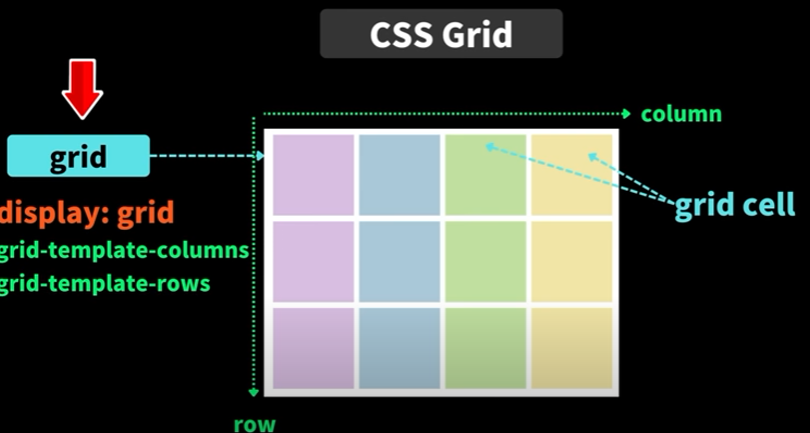

# Grid(그리드)

Flex는 1차원적으로 배치할 수 있는 반면, Grid는 2차원적으로 배치할 수 있다.

- `grid cell`: 각각의 셀
  - `grid-column-start`
  - `grid-column-end`
  - `grid-row-start`
  - `grid-row-end`
- `grid-template-columns`: columns 사이즈 지정
- `grid-template-rows`: rows 사이즈 지정
- `grid-gap`: 셀 간의 간격
- `grid-template-areas`: 좀 간편하게 Grid 영역을 지정할 수 있다.
