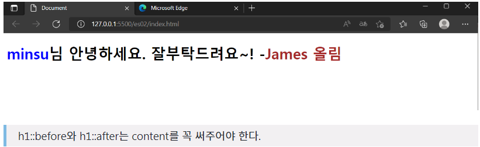

# 가상 요소 셀렉터

가상 요소 셀렉터란 선택한 요소 안의 특정 부분을 선택하는 것을 말한다. 자주 사용하는 것이 ::before와 ::after가 있다.

## ::before & ::after

::before란 요소를 선택하기 전에 적용하는 것을 말한다. 반대로 ::after는 요소를 선택하기 후에 적용하는 것을 말한다.  
예를 들어보면 빠르게 이해할 수 있다.

```html
<!DOCTYPE html>
<html lang="en">
  <head>
    <meta charset="UTF-8" />
    <meta http-equiv="X-UA-Compatible" content="IE=edge" />
    <meta name="viewport" content="width=device-width, initial-scale=1.0" />
    <title>Document</title>
    <style>
      h1::before {
        content: "minsu";
        color: blue;
      }
      h1::after {
        content: "James 올림";
        color: brown;
      }
    </style>
  </head>
  <body>
    <h1>님 안녕하세요. 잘부탁드려요~! -</h1>
  </body>
</html>
```

안에 내용을 보면 "누구누구님 안녕하세요 -누구누구 올림" 이라고 쓰고 싶다. 그러면 h1::before을 사용하게 되면 h1 태그의 내용이 화면에 나타나기 전에 content를 출력한다. 또한 h1::after를 사용하게 되면 h1 태그의 내용이 화면에 나타난 후에 마지막에 content를 출력한다. 그래서 렌더링된 화면의 모습은 다음과 같다.


