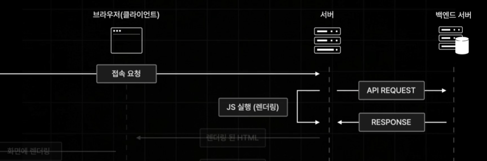

# 데이터 페칭

백엔드 서버로부터 데이터를 가져오기 위해서는 데이터 페칭을 통해 가져올 수 있다.

기존의 리액트의 경우 모든 컴포넌트가 마운트 되었을 때 데이터 페칭 작업을 수행하는데 처음 마운트 과정이 꽤 걸리기 때문에 데이터까지 가져오는 과정 또한 시간이 추가된다.

- 컴포넌트 마운트 이후에 발생함
- 데이터 요청 시점이 느려지게 되는 단점 발생

그래서 Next는 사전 렌더링을 통해 리액트의 단점인 처음 마운트 과정이 오래 걸렸던 시간을 단축시킬 수 있었다. 또한 Next는 서버와 백엔드 서버간에 미리 데이터 페칭을 통해 데이터를 가져와서 데이터를 가져오는 시간까지 단축할 수 있는 장점이 있다.

- 사전 렌더링중 발생함 (당연히 컴포넌트 마운트 이후에도 발생 가능)
- 데이터 요청 시점이 매우 빨리지는 장점이 있음

> Next에도 사전 렌더링 과정에서 에러가 발생한다거나 용량이 너무 큰 경우 느릴 수 있는데 이러한 과정을 여러 방식(사전 렌더링)으로 제공한다.
