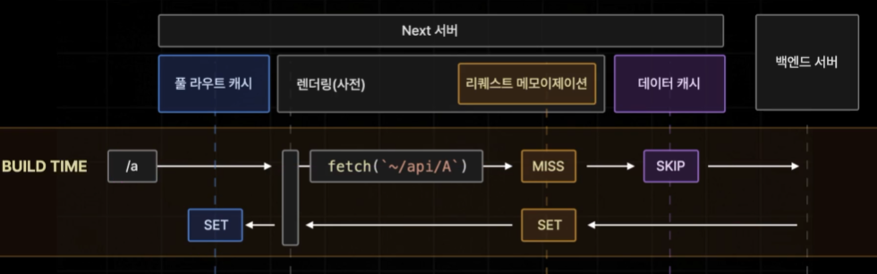

# 풀 라우트 캐시

풀 라우트 캐시(Full Route Cache)는 Next 서버측에서 빌드 타임에 특정 페이지의 렌더링 결과를 캐싱하는 기능이다.

Next의 모든 페이지들은 서버 컴포넌트의 경우에만 정적 페이지(Static Page)와 동적 페이지(Dynamic Page)로 나뉜다. 정적 페이지인 경우에는 풀 라우트 캐시가 적용된다.

#### Dynamic Page로 설정되는 기준

특정 페이지가 접속 요청을 받을 때 마다 매번 변화가 생기거나 데이터가 달라질 경우

- 캐시되지 않는 Data Fetching을 사용할 경우
- 동적 함수(쿠키, 헤더, 쿼리스트링)을 사용하는 컴포넌트가 있을 떄

#### Static Page로 설정되는 기준

Dynamic Page가 아니면 모두 Static Page가 된다 (Default)

## 클라이언트 라우터 캐시

클라이언트 라우터 캐시란 브라우저에 저장되는 캐시로 페이지 이동을 효율적으로 진행하기 위해 페이지의 일부 데이터를 보관하는 기능이다. Next 서버가 브라우저에게 보내주는 여러가지 페이지의 데이터들 중 루트 레이아웃이나 서치바 레이아웃처럼 해당하는 페이지의 레이아웃을 담당하는 RSC 페이로드의 데이터만 클라이언트 라우터 캐시라는 공간에 캐시하게 된다. 그러면 앞으로 새로운 요청이 들어와도 레이아웃을 중복으로 불러오지 않아도 된다.
