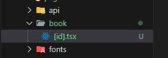

# 페이지 라우터 (Page Router)

페이지 라우터(Page Router)는 React Router처럼 페이지 라우팅 기능을 제공한다. `pages` 폴더의 구조를 기반으로 페이지 라우팅이 제공된다.

## 장점

- 파일 시스템 기반의 간편한 페이지 라우팅 제공
- 다양한 방식의 사전 렌더링 제공
  - SSR: 요청이 들어올 때마다 사전 렌더링을 진행함. 항상 최신의 데이터를 불러오는 장점은 있지만 백엔드 서버에서 시간이 길어지면 그만큼 대기시간도 길어진다.
  - SSG: SSR 단점을 해결한 방식으로 빌드 타임에 미리 페이지를 사전 렌더링 해둔다. 다만 빌드 타임 이후에는 재생성하지 않기 떄문에 최신 데이터를 반영하기에는 어렵다.
  - ISR: SSG 단점을 해결한 방식으로 빌드 타임에 미리 페이지를 사전 렌더링 해두되, 일정시간마다 페이지가 재생성된다. 하지만 만약 요청이 들어온 이후에만 재생성하려면 On-Demand ISR 방식으로 사용해야 한다.

## 단점

- 페이지별 레이아웃 설정이 번거롭다.
- 데이터 페칭이 페이지 컴포넌트에 집중된다.
- 불필요한 컴포넌트들도 JS Bundle에 포함된다.

## Pages 폴더

pages 폴더에는 페이지 라우팅할 파일을 관리한다.

#### \_app.tsx

pages 폴더에 있는 \_app.tsx 파일은 리액트의 `app.tsx`와 동일한 역할을 한다. 즉, 루프 컴포넌트로써 역할을 수행한다. (모든 페이지 컴포넌트들의 부모 컴포넌트)

- Component: 페이지 역할을 하는 컴포넌트
- pageProps: Component에 전달될 Props 객체

#### \_document.tsx

pages 폴더에 있는 \_document.tsx 파일은 모든 페이지에 공통적으로 적용되어야 하는 HTML 코드를 설정하는 컴포넌트이다. 기존의 리액트에서 `index.html`과 동일한 역할을 수행한다.

## query string

쿼리 스트링 값은 `useRouter`라는 훅을 사용하여 가져올 수 있다.

```javascript
import { useRouter } from "next/router";

export default function Page() {
  const router = useRouter();
  const { q } = router.query;
  return <h1>Search {q}</h1>;
}
```

## path variable



위 그림과 같이 파일을 `[id].tsx`로 만들면 `[id]`에 경로 값이 렌더링된다.

```javascript
import { useRouter } from "next/router";

export default function Page() {
  const router = useRouter();
  const { id } = router.query;

  return <h1>Book {id}</h1>;
}
```
