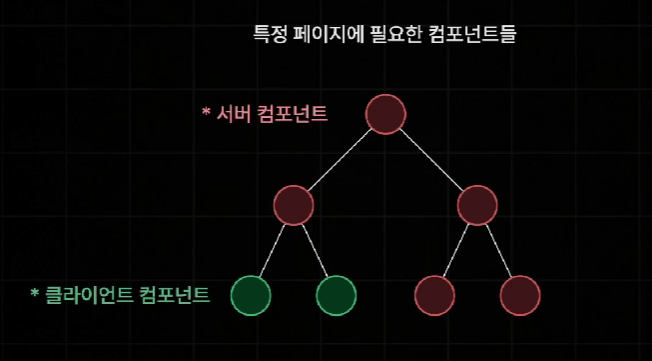

# React Server Component

React Server Component는 React 18v부터 새롭게 추가된 새로운 유형의 컴포넌트로, 서버측에서만 실행되는 컴포넌트이다. (브라우저 실행 X)

모든 컴포넌트들은 상호작용의 유무에 따라 빨간색의 서버 컴포넌트와 초록색의 클라이언트 컴포넌트로 나뉘게 된다.

#### 서버 컴포넌트

- 서버측에서 사전 렌더링을 진행할 때 딱 한번만 실행됨

#### 클라이언트 컴포넌트

- 사전 렌더링 진행할 때 한번, 하이드레이션 진행할 때 한번 해서 총 두번 실행된다.

따라서 페이지의 대부분을 서버 컴포넌트로 구성할 것을 권장하고, 클라이언트 컴포넌트는 꼭 필요한 경우에만 사용해야 한다. 이는 서버 컴포넌트가 많아질 수록, 클라이언트 컴포넌트가 줄어들 수록 Next 서버가 브라우저에게 전달하게 되는 JS 번들 파일의 용량도 함께 줄어들기 때문이다.

> Next.js에서는 기본적으로 모든 컴포넌트가 서버 컴포넌트로 작동된다.

## 주의사항

- 서버 컴포넌트에는 브라우저에서 실행될 코드가 포함되면 안된다.
- 클라이언트 컴포넌트는 클라이언트에서만 실행되지 않는다.
- 클라이언트 컴포넌트에서는 서버 컴포넌트를 import 할 수 없다.
- 서버 컴포넌트에서 클라이언트 컴포넌트에게 직렬화 되지 않는 Props는 전달 불가하다.
