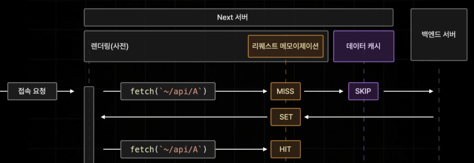

# 리퀘스트 메모이제이션

리퀘스트 메모이제이션(Request Memoization)은 하나의 페이지를 이루고 있는 여러개의 컴포넌트에서 발생하는 다양한 API 요청들중에 중복적으로 발생하는 요청들을 캐싱해서 단 한번만 요청할 수 있도록 데이터 페칭을 최적화해주는 기능이다.

위 그림과 같이 데이터 캐시 전에 리퀘스트 메모이제이션이 있고, 백엔드 서버 또는 데이터 캐시를 거치지 않고 리퀘스트 메모이제이션에 Hit가 있으면 바로 사용할 수 있는 구조이다.

그래서 리퀘스트 메모이제이션은 데이터 캐시와는 다르고, 하나의 페이지를 렌더링하는 동안에 중복된 API 요청을 캐싱하기 위해 존재한다. 그래서 렌더링이 종료되면 모든 캐시가 즉시 소멸된다.

데이터 캐시의 목적은 백엔드 서버로부터 불러온 데이터를 거의 영구적으로 보관하기 위해 사용된다. (서버 가동중에는 영구적으로 보관된다.)
