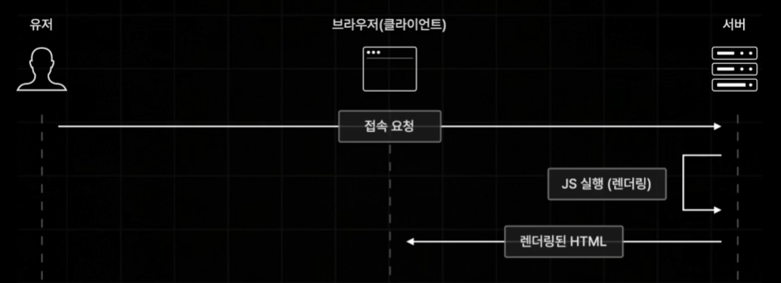

# Next.js란

Next.js는 React.js를 보다 더 강력하고 편하게 사용할 수 있는 기능들을 제공하는 프레임워크이다. 쉽게 말해 React.js의 확장판이라 생각하면 된다.

## 사전 렌더링 (Pre Rendering)

사전 렌더링은 브라우저의 요청에 사전에 렌더링이 완료된 HTML을 응답하는 렌더링 방식이다. Client Side Rendering의 단점을 효율적으로 해결하는 기술이다.

위 그림처럼 요청이 오면 서버에서 JS를 실행하여 사전에 렌더링될 HTML을 생성한다. 생성이 완료되면 렌더링할 완료된 HTML을 브라우저에게 응답으로 보내주는 방식이다.

CSR(Client Side Rendering)은 요청이 오면 서버에서 JS 번들링 작업을 하여 클라이언트에 보내준다. 그러면 번들링된 JS를 클라이언트에서 실행하여 페이지 이동이 빠르고 쾨적하다는 장점이 있지만 **초기 접속 속도가 느리다는 단점**이 있다.

Next.js는 이러한 CSR의 단점을 해결하기 위해 사전 렌더링 기능을 제공한다. 즉, 서버에서 JS 번들링 작업을 실행해서 사전에 HTML를 렌더링시킨다. 이렇게 렌더링된 HTML을 클라이언트에게 보내준다. 그와 동시에 유저와 상호 작용하는 기능을 동작할 수 있도록 JS 번들링 파일도 같이 보내준다. 그래서 클라이언트는 HTML을 렌더링하고, JS 번들링 파일을 실행한다.
