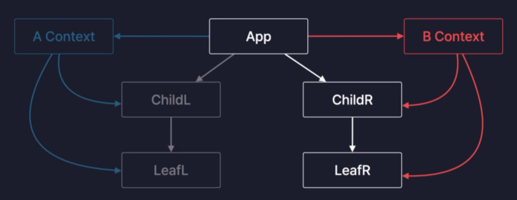
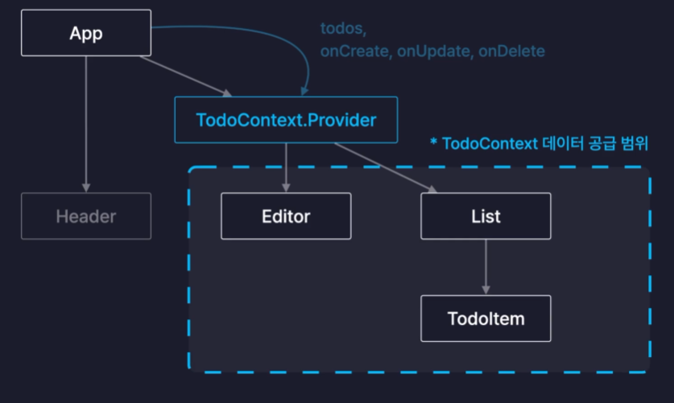
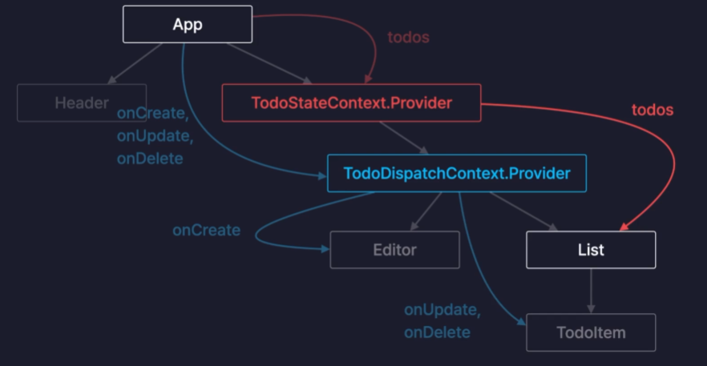

# React Context

Context는 컴포넌트간의 데이터를 전달하는 또 다른 방법을 말한다. 기존의 Props가 가지고 있던 단점을 해결할 수 있다.

## Props 단점

Props의 단점은 Props Drilling이다. 기존의 Props는 부모 -> 자식으로만 데이터를 전달하고 있기 때문에 부모 -> 자식의 자식으로 다이렉트로는 전달할 수 없다. (이 떄는 부모 -> 자식(부모) -> 자식으로 차례로 넘겨야 했다.) 이렇게 차례로 데이터를 전달하는 것을 Props Drilling이라 한다.

Props Drilling은 웹서비스의 규모가 적다면 괜찮겠지만 조금만 규모가 커져도 상위 컴포넌트들이 많기 떄문에 매번 같은 Props를 매번 넘겨주어야 하는 매우 불편한 상황이 발생한다.



그래서 이러한 단점을 해결하기 위해 나온 것이 React의 Context API이다.

## 사용법

### 부모 컴포넌트

```javascript
export const TodoContext = createContext();

...

return (
  <>
    <div className="App">
      <Header />
      <TodoContext.Provider
        value={{
          todos,
          onCreate,
          onUpdate,
          onDelete,
        }}
      >
        <Editor onCreate={onCreate} />
        <List todos={todos} onUpdate={onUpdate} onDelete={onDelete} />
      </TodoContext.Provider>
    </div>
  </>
);
```

- Context는 컴포넌트 외부에서 생성한다.
- Provider 컴포넌트를 사용하여 데이터를 공급할 자식 컴포넌들을 감싸면 된다.

### 자식 컴포넌트

```javascript
import { useRef, useState, useContext } from "react";
import { TodoContext } from "../App";

const Editor = () => {
  const { onCreate } = useContext(TodoContext);
  ...
}
```

- 자식 컴포넌트에서 사용할 때는 useContext 함수를 사용하여 인수로는 부모 컴포넌트에서 사용했던 TodoContext를 넣어준다.



## Context 분리하기

Props 값이 변경되면 리렌더링이 발생하게 되는데, 이 때 성능 최적화를 위해 memo 메서드를 사용하여 최적화를 진행했다. 하지만 Context 추가 후 다시 렌더링이 진행되었는데 그 이유는 아래 코드에서 왼쪽에 객체를 결국 다시 생성하게 되기 때문에 새로운 참조값이 생성되는 것이다.

```javascript
const { onCreate } = useContext(TodoContext);
```

즉, useContext는 Props가 변경되었을 때와 동일하게 리렌더링이 발생된다. 그래서 해결방법은 변경되지 않는 값은 새로운 Context를 새로 만들어서 분리할 필요가 있다.



### 사용법

```javascript
export const TodoStateContext = createContext();
export const TodoDispatchContext = createContext();

const memoizedDispatch = useMemo(() => {
  return { onCreate, onUpdate, onDelete };
}, []);

return (
  <>
    <div className="App">
      <Header />
      <TodoStateContext.Provider value={todos}>
        <TodoDispatchContext.Provider value={memoizedDispatch}>
          <Editor />
          <List />
        </TodoDispatchContext.Provider>
      </TodoStateContext.Provider>
    </div>
  </>
);
```
