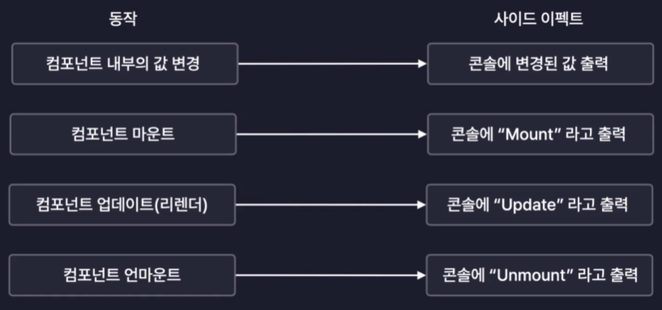

# useEffect

useEffect란 리액트 컴포넌트의 사이드 이펙트를 제어하는 새로운 React Hook이다. 사이드 이펙트란 컴포넌트의 동작에 따라 파생되는 여러 효과를 말한다.



예를 들어, 값이 변경되었거나 콘솔에 출력한다거나 컴포넌트가 마운트 되었을 때 서버에 데이터를 가져온다거나 등의 행위를 말한다. 이러한 행위들 모두 사이드 이펙트를 제어라고 한다. 즉, useEffect는 리액트의 라이프싸이클에서 사이드 이펙트를 제어할 수 있는 훅인 것이다.

## Mount

```javascript
const [count, setCount] = useState(0);

// 1. 마운트: 탄생
useEffect(() => {
  console.log("mount");
}, [count]);
```

- 두번째 인수인 `[]` 배열에 값이 바뀌게 되면 첫번째 인수인 콜백함수를 실행시키게 된다. 즉, count의 값이 변경된 경우에만 콜백함수가 실행된다.
- 참고로 두번째 인수인 `[]` 배열을 의존성 배열, deps라 불린다.
- deps를 빈배열로 두면 컴포넌트가 처음 생성되었을 때 딱 최초로 한번만 콜백함수가 실행된다.

## Update

```javascript
const isMount = useRef(false);

// 2. 업데이트: 변화, 리렌더링
useEffect(() => {
  if (!isMount.current) {
    isMount.current = true;
    return;
  }
  console.log(`count: ${count}`);
}, [count]);
```

- Update가 될 때마다 콜백함수가 실행된다.

## UnMount

```javascript
useEffect(() => {
  // 클린업, 정리함수
  return () => {
    console.log("unmount");
  };
}, []);
```

- 컴포넌트가 사라질 때 정리함수가 실행된다.
