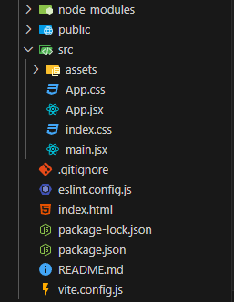

# React 폴더&파일 구조

| public

- svg, png, jpg 같은 이미지 파일이나 폰트나 동영상 같은 정적인 리소스들을 관리한다.

| src

- 소스의 약자로 실제로 소스코드들이 있다.

| assets

- 정적인 리소스들을 관리한다.

| eslintrc.cjs

- eslint 도구의 설정 파일이다.

| index.html

- root 요소와 main 스크립트 파일을 불러오는 코드가 있다.
- 리액트에서 가장 기본적인 틀을 구성하는 파일이다.

| main.jsx

- `index.html` 파일에 있는 root 요소를 렌더링한다.

| App.jsx

- React의 컴포넌트이다.

| vite.config.js

- vite 도구의 설정 파일이다.
