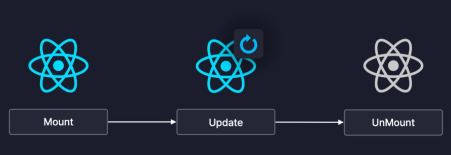

# 라이프싸이클

모든 프로그램에는 라이프싸이클이 존재하는데 리액트 역시 라이프싸이클이 있다. 라이프싸이클이 있으면 어떠한 단계에만 기능들을 동작하거나 서버 통신하는 등 특정 순간에 기능을 동작하게 하는 것이 가능하다. (안드로이드 역시 액티비티의 라이프싸이클 등이 중요한것처럼!)

| Mount

- 컴포넌트가 생성된 순간을 말한다.
- 즉, 화면에 처음 렌더링되는 순간이다.
- ex. 서버에서 데이터를 불러오는 작업

| Update

- Mount 이후에 컴포넌트가 리렌더링되는 순간이다. (State가 변경될 때)
- ex. 어떤 값이 변경되었는지 콘솔에 출력

| UnMount

- 컴포넌트가 화면에서 사라지는 순간
- 즉, 렌더링에서 제외되는 순간을 의미한다.
- ex. 컴포넌트가 사용하던 메모리 정리

리액트에서 사이드 이펙트를 제어하는 useEffect 객체는 보통 성능을 최적화할 떄 자주 사용될 수 있다.
