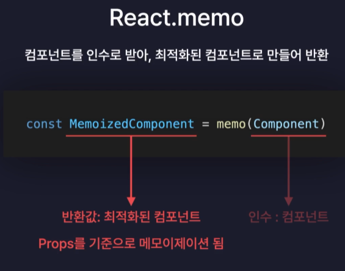

# useMemo

useMemo는 "메모이제이션" 기법은 기밙으로 불필요한 연산을 최적화하는 리액트 훅이다. 알고리즘에서 시간을 단축시키기 위해 메모이제이션 기법을 사용한다.

```javascript
const getAnalyzedData = () => {
  const totalCount = todos.length;
  const doneCount = todos.filter((todo) => todo.isDone).length;
  const notDoneCount = totalCount - doneCount;

  return {
    totalCount,
    doneCount,
    notDoneCount,
  };
};

const { totalCount, doneCount, notDoneCount } = getAnalyzedData();
```

- filter라는 함수는 todos의 크기에 따라 속도에 영향을 미친다. filter 처음부터 끝까지 돌면서 조건에 맞는 것들을 추리기 때문에 풀스캔을 하게된다.
- 그래서 리렌더링될 때마다 계속 호출해주게 되면 성능이 악화될 수 있다.
- 결론적으로는 해당 부분은 메모이제이션 기법을 사용하면 성능을 최적화할 수 있다.

```javascript
const { totalCount, doneCount, notDoneCount } = useMemo(() => {
  // 메모이제이션 하고 싶은 연산
  const totalCount = todos.length;
  const doneCount = todos.filter((todo) => todo.isDone).length;
  const notDoneCount = totalCount - doneCount;

  return {
    totalCount,
    doneCount,
    notDoneCount,
  };
}, [todos]);
// 의존성 배열: deps
```

- 의존성 배열인 deps의 값이 변경되었을 때 콜백함수가 실행된다.
- 실행된 콜백함수의 반환 값을 변수로 받을 수 있다.
- deps가 빈 배열인 경우 컴포넌트 최초로 렌더링 되었을 때 딱 한번만 콜백함수가 실행된다.
- 즉, 아까처럼 매번 리렌더링될 때마다 성능이 악화되는 것을 고려할 필요가 없게되는 것이다.

## React.memo

컴포넌트를 인수로 받아 최적화된 컴포넌트로 만들어 반환시킨다.



- 부모에서 자식으로 넘기는 Props 값이 바뀌지 않으면 불필요한 리렌더링이 되지 않기 때문에 최적화가 될 수 있다.

```javascript
import { memo } from "react";

const Header = () => {
  return (
    <div className="Header">
      <h3>오늘은 👻</h3>
      <h1>{new Date().toDateString()}</h1>
    </div>
  );
};

const memoizedHeader = memo(Header);

export default memoizedHeader;
```

- 사용은 간단하며 Memo 컴포넌트를 이용하여 불필요한 리렌더링되지 않도록 한다.

## 주의

- momo 메서드는 내부에서 Props를 변경되었을 때만 렌더링이 일어난다.
- 이 때 이전 Props와 이후 Props를 비교할 때 얕은 비교(===)로 수행하게 된다. 즉, 객체 타입은 참조값으로 비교한다는 의미이다.
- 만약 렌더링이 일어나면 `onCreate`, `onUpdate`와 같은 객체 타입의 함수들이 매번 새로 생성되기 때문에 각기 다른 참조값을 가지게 되어 이전 Props와 이후 Props가 서로 다르다고 판별하여 리렌더링이 일어난다.

### 객체 타입 Memo 비교

| 1. 콜백함수 처리

위에서 객체타입의 비교는 어렵다고 했다. 그렇다면 어떻게 해결할 수 있을까?

```javascript
export default memo(TodoItem, (prevProps, nextProps) => {
  // 반환값에 따라 Props가 바뀌었는지 안바꼈지는 판단
  // T -> Props 변경 안됨 -> 리렌더링 X
  // F -> Props 변경 됨 -> 리렌더링 O
  if (prevProps.id !== nextProps.id) return false;
  if (prevProps.isDone !== nextProps.isDone) return false;
  if (prevProps.content !== nextProps.content) return false;
  if (prevProps.date !== nextProps.date) return false;

  return true;
});
```

- memo 메소드에 두번째 인수로 콜백함수로 받아서 비교 연산을 처리해주면 된다.
- 콜백함수에는 두 개의 인자(prevProps, nextProps)를 받아서 `True` 아니면 `False`를 리턴시키면 된다.

| 2. useCallback 처리

다른 방법으로는 useCallback 함수를 사용하는 것이다.

```javascript
// const onDelete = (targetId) => {
//   dispatch({
//     type: "DELETE",
//     targetId: targetId,
//   });
// };

const onDelete = useCallback((targetId) => {
  dispatch({
    type: "DELETE",
    targetId: targetId,
  });
}, []);
```

- useCallback 역시 useMemo와 같이 메모이제이션 기법을 사용하여 deps가 변경되면 첫번째 인수인 콜백함수를 그대로 생성해서 반환해준다. 즉, 콜백함수에는 렌더링을 방지하고 싶은 함수를 넣어준다.
- deps가 비어있으면 렌더링된 최초로 딱 한번만 콜백함수가 생성된다.

### 그렇다면 최적화를 언제하는 것이 좋을까?

- 보통은 React의 프로젝트가 완성된 후에 최적화를 진행한다.
  - 기능 개발 -> 테스트 -> 최적화 -> 테스트
- 꼭 최적화가 필요할 것 같은 연산, 함수, 컴포넌트에만 최적화를 적용해주는 것이 좋다.
  - 그 이유는 최적화를 위해 사용하는 memo 메서드나 useCallback 같은 함수 역시도 연산이 들어가기 때문에 매우 단순한 컴포넌트 같은 경우에는 굳이 적용하지 않는 것이 좋다.
  - 반대로 무거운 비즈니스 로직이 들어있거나 사용자의 이벤트가 많은 경우에 최적화를 진행하는 것이 좋다.
