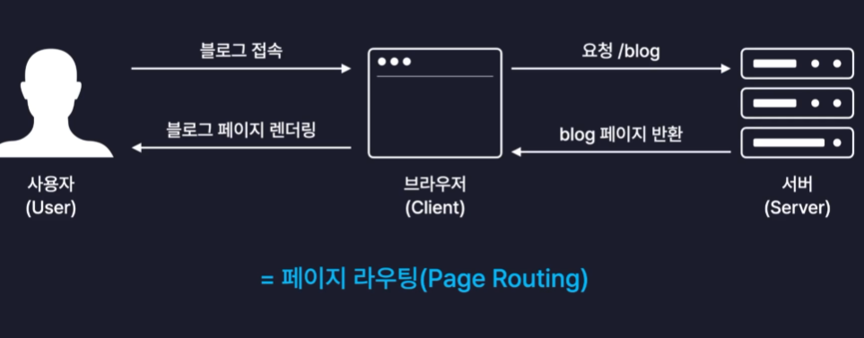
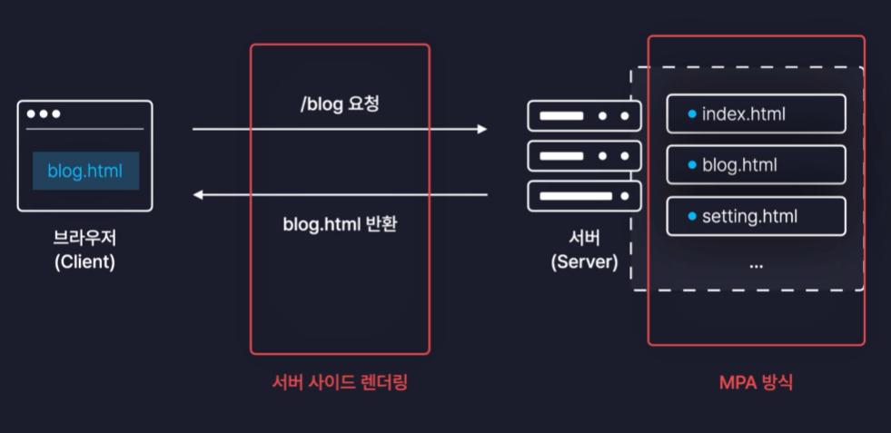

# 페이지 라우팅



페이지 라우팅은 경로에 따라 알맞은 페이지를 렌더링 하는 과정을 말한다.

## SSR과 MPA



브라우저에서 서버로 요청하면 그에 맞는 HTML 화면을 렌더링하는 방식으로 서버가 화면을 결정하고 브라우저에 렌더링할 화면을 반환해준다. 이러한 방식은 SSR이라 한다.

MPA는 Multi Page Application의 약자로 서버가 여러개의 페이지를 가지고 있는 것을 말한다. 다만 MPA 방식은 브라우저 요청하고 서버에서 적절한 HTML을 반환해주는데 이 때 새로운 페이지를 다시 전체적으로 렌더링하기 때문에 페이지 마치 새로고침 되는 것처럼 한번 깜박이는 현상이 있다. 또한 속도도 화면은 새로 다시 받아야 하기 때문에 느릴 수 있다. 또한 사용자가 많아질수록 서버에 먹는 부하가 점점 심해진다.

## CSR과 SPA

SPA는 Single Page Application의 약자로 서버에서 렌더링할 페이지가 `index.html` 딱 하나인 것을 말한다. 즉, MPA와 다르게 SPA는 무조건 하나의 파일만 반환해준다. SPA는 페이지 이동이 매끄럽고 효율적이다. 따라서 다수의 사용자가 접속해도 크게 상관 없다.

또한 수많은 자바스크립트 파일들은 하나로 묶어서 즉, 번들링된 하나의 파일로 묶어서 전달해준다. 그러면 브라우저에서 `index.html`은 번들링된 JS 파일을 실제로 실행하면 모든 컴포넌트들이 화면에 렌더링된다. 또한 이러한 방식을 CSR이라 한다. 즉, 서버에서 각기 다른 HTML을 반환해주는 것이 아니라 하나의 파일만 반환해주고, 그리고 번들링된 JS 파일을 실행시키는 렌더링 과정이 브라우저에서 이루어진다.

## 라이브러리

리액트 라우팅을 처리하려먼 React Router라는 라이브러리를 사용하면 편하다.

| 설치

```javascript
npm i react-router-dom
```

| 사용

#### main.jsx

```javascript
import { createRoot } from "react-dom/client";
import App from "./App.jsx";
import "./index.css";
import { BrowserRouter } from "react-router-dom";

createRoot(document.getElementById("root")).render(
  <BrowserRouter>
    <App />
  </BrowserRouter>
);
```

#### App.jsx

```javascript
import "./App.css";
import { Routes, Route } from "react-router-dom";
import Home from "./pages/Home";
import Diary from "./pages/Diary";
import New from "./pages/New";

function App() {
  return (
    <Routes>
      <Route path="/" element={<Home />} />
      <Route path="/new" element={<New />} />
      <Route path="/diary" element={<Diary />} />
      <Route path="*" element={<NotFound />} />
    </Routes>
  );
}

export default App;
```

## 주의 사항

- Routes 컴포넌트 안에는 무조건 Route 컴포넌트만 들어갈 수 있다. 다른 태그나 다른 컴포넌트가 들어가면 에러가 발생한다.
- Routes 컴포넌트 바깥에 정의된 컴포넌트들은 페이지 라우팅과 상관없이 모든 페이지에 렌더링이 된다.
  - 되도록 Routes 컴포넌트 바깥에 정의된 컴포넌트들을 사용하지 말자.

## 페이지 이동

| Link 컴포넌트

```javascript
function App() {
  return (
    <>
      <div>
        <Link to={"/"}>Home</Link>
        <Link to={"/new"}>New</Link>
        <Link to={"/diary"}>Diary</Link>
      </div>
      ...
    </>
  );
}
```

- 페이지 이동은 Link 컴포넌트를 이용할 수 있다.
- Link 컴포넌트는 새로고침이 아닌 렌더링이 필요한 컴포넌트만 리렌더링이 일어난다.
- 페이지 이동은 절대 a 태그를 사용하지 말자.

| useNavigate

또다른 방법으로는 useNavigate 함수를 사용하는 것이다. 이 방식은 특정 조건에 따라 동작시키려고 할 때 유용하다.

```javascript
function App() {
  const nav = useNavigate();

  const onClickButton = () => {
    nav("/new");
  };
  return (
    <>
      ...
      <button onClick={onClickButton}>New 페이지로 이동</button>
      ...
    </>
  );
}
```

## 동적 경로

말 그대로 동적인 경로가 포함된 경우이다.

- ~/product/1 (1번 상품 페이지)
- ~/product/2 (2번 상품 페이지)
- ...

| URL Parameter

- 아이템의 id 등의 변경되지 않는 값을 주소로 명시하기 위해 사용된다.

| Query String

- 검색어 등의 자주 변경되는 값을 주소로 명시하기 위해 사용된다.

### 사용법

| URL Parameters

```javascript
// App.jsx
<Route path="/diary/:id" element={<Diary />} />;

// Diary.jsx
import { useParams } from "react-router-dom";

const Diary = () => {
  const params = useParams();

  return <div>{params.id}번 일기입니다~</div>;
};

export default Diary;
```

| Query String

```javascript
import { useSearchParams } from "react-router-dom";

const Home = () => {
  const [params, setParams] = useSearchParams();

  return <div>Home</div>;
};

export default Home;
```
