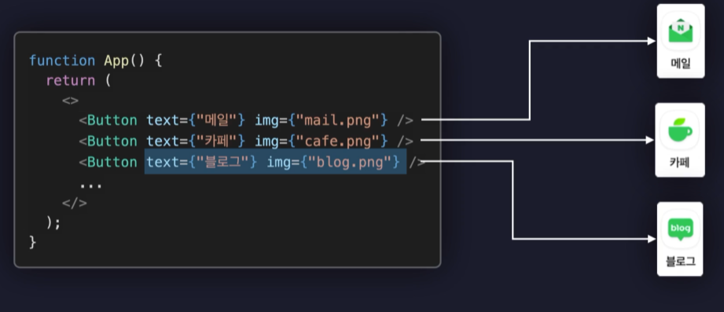

# Props

React는 컴포넌트를 기반으로 UI를 개발한다. 그렇다면 컴포넌트마다 데이터를 다르게 주려면 어떻게 해야될까? 바로 `props`를 전달하면 된다.



위 이미지처럼 컴포넌트에 인수처럼 props의 값들을 전달할 수 있다.

```javascript
const HookExam = (props) => {
  return <div>{props.name}</div>;
};

HookExam.defaultProps = {
  color: "red",
};

export default HookExam;
```

- props를 받을 때는 위 코드와 같이 함수 인자에 props를 받아서 사용할 수 있다.
- 또한 props의 값이 없다면 `defaultProps`로 기본값을 설정할 수 있다.
- props는 오직 부모 컴포넌트에서 자식 컴포넌트로만 전달할 수 있다. (자식에서 자식 컴포넌트로는 전달 못한다.) 이러한 데이터 흐름을 단방향 데이터 흐름이라고 한다.

## children

```javascript
function App() {
  return (
    <>
      <HookExam>
        <div>자식요소</div>
      </HookExam>
    </>
  );
}
```

- 컴포넌트에 자식요소가 있을 때 children으로 props를 받을 수 있다.

```javascript
const HookExam = (props, children) => {
  return <div>{children}</div>;
};

...

```

- 그러면 자식요소인 `<div>자식요소</div>`가 렌더링된다.
