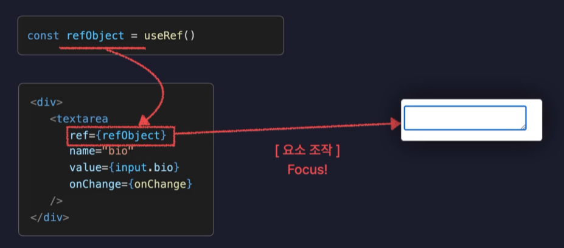

# useRef

useRef는 새로운 Reference 객체를 생성하는 기능이다.

useRef는 컴포넌트 내부에 변수로 활용이 가능하다는 점에서 useState와 굉장히 비슷하다. 다만 useState는 값이 변경되면 컴포넌트를 리렌더링시키지만, useRef는 컴포넌트를 어떠한 경우에도 다시 리렌더링시키지 않는다. 즉, 변수로는 사용하고 싶은데 컴포넌트를 리렌더링 시키고 싶지 않다면 useRef 기능을 사용하며 된다.



또한 useRef는 컴포넌트가 렌더링하는 특정 DOM 요소에 접근이 가능하며, 해당 요소를 조작하는 것 역시 가능하다.

## 문법

```javascript
// ref 객체 생성
const countRef = useRef(0);

// ref 변수 접근 -> current
countRef.current++;
```

## 왜 사용?

useRef의 용도는 리렌더링 시키지 않으면서 변수로써 사용한다면 그냥 JavaScript 변수로 선언하면 되는거 아닌가? 할 수 있다.

결론부터 말하면 안된다.

컴포넌트 안에서 왜 그냥 변수로 할당하면 안될까? 그 이유는 State 값이 변경되면 컴포넌트가 리렌더링이 되는데, 그냥 변수는 계속 초기화된 값에서 변경되는 것이다. 즉, 값의 상태가 유지되지 않고 계속 초기화되면서 렌더링되기 때문에 원하는 값을 얻을 수가 없다.

그러나 useRef나 useState로 만든 React의 특수한 객체들은 변수가 초기화되지 않는데 그것을 React 라이브러리 내부에서 그렇게 동작하도록 만들었기 때문이다.

질문1) 그렇다면 그냥 변수를 전역변수로 선언하면 되는거 아닐까?

답변1) 컴포넌트를 재활용 하지 않고, 한번만 사용하면 가능은 하겠지만 두번이상 사용한다면 해당 변수는 공유하여 사용되기 떄문에 의도치 않은 에러가 발생할 수 있다. 이는 백엔드에서 매우 중요한 동시성 이슈와 비슷하다.
