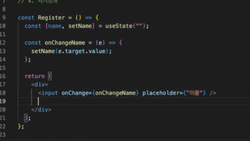
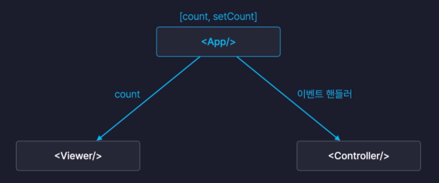

# State 상태관리

State는 변화할 수 있는 동적인 값을 말한다. State의 값이 변경됨에 따라 렌더링되는 UI도 변경되기 때문에 State는 중요하다. 리액트에서 State 값이 변경되면 해당 State가 선언된 컴포넌트가 다시 리렌더링된다.

## 문법

```javascript
import { useState } from "react";
import "./App.css";

function App() {
  const [count, setCount] = useState(0);
  return (
    <>
      <h1>{count}</h1>
      <button
        onClick={() => {
          setCount(count + 1);
        }}
      >
        +
      </button>
    </>
  );
}

export default App;
```

- button을 클릭하면 count 값을 1씩 증가시키며, State 값을 업데이트 시킨다. State 값을 업데이트되면 리렌더링되면서 컴포넌트를 다시 그리고, State값이 바뀐 화면을 볼 수 있다.
- 참고로 useState 함수는 비동기로 실행된다는 것을 기억하자.

## State와 Props

State 값을 Props로 전달하면 어떻게 될까? 여기서 아주 중요한 개념이 생긴다.

부모 컴포넌트에서 State값을 선언하고, 부모 컴포넌트 -> 자식 컴포넌트로 State 값을 Props로 전달하게 되면 부모 컴포넌트에서 State 값이 변경될 시 자식 컴포넌트 역시 리렌더링된 다는 것을 기억하자.

다시 말해, 부모 컴포넌트의 State 값이 변경되면 Props로 전달받은 자식 컴포넌트 역시 리렌더링된다.

## 리렌더링

여기서 어떤 조건에서 컴포넌트가 리렌더링되는지 알아보자.

1. State 값이 변경되었을 때
2. 전달받은 Props 값이 변경되었을 때
3. 부모 컴포넌트가 리렌더링되면 자식 컴포넌트들도 리렌더링 된다.

여기서 중요한 점은 3번인데, 만약 모든 State들을 부모 컴포넌트에서 관리하게 되면 자식 컴포넌트들 중에서 사용하지 않는 State 값이 변경되었을 때 의도치 않은 리렌더링이 발생하게 되어 성능이 안좋아진다.

따라서 State는 보통 해당 State가 필요한 자식 컴포넌트에서 관리하게 된다. 이렇게 되면 불필요한 리렌더링을 막을 수 있게 된다.

## 사용자 입력

리액트에서 사용자 입력을 받을 때는 `onChange` 속성을 통해 State 값을 업데이트 시킬 수 있다.



일반적으로 위와 같이 코드를 작성한다. 그러면 사용자가 입력할 때마다 State 값을 업데이트 시키게 된다. 또한 위와같이 `onChange` 같은 이벤트 핸들러 속성을 통해 사용자의 입력을 감지하고 State 값을 변경하는 식의 바인딩을 양방향 바인딩이라 한다.

## State Lifting



자식 컴포넌트들끼리는 State를 서로 공유할 수 없다. 그렇다면 방법은 자식 컴포넌트들의 부모인 부모 컴포넌트에서 State를 선언하면 자식 컴포넌트들에게 props로 값을 전달할 수 있다. 이러한 방식을 State 끌어올리기라고 한다.
