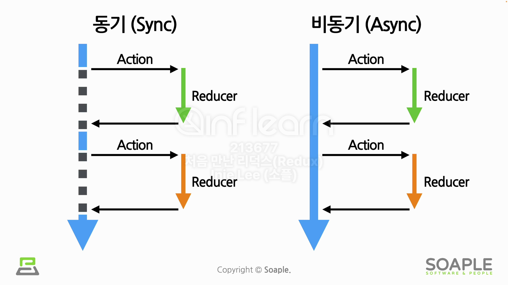
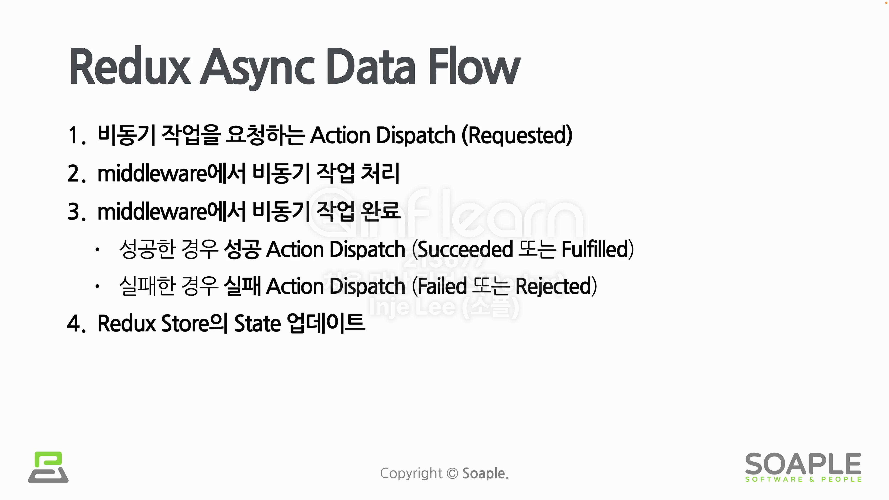
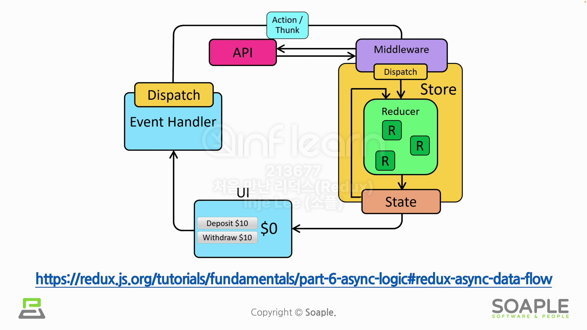

# Async Logic

위 그림에서 차이는 Reducer가 Action을 처리하는 방식이 동기냐 비동기냐의 차이이다. 하지만 Redux에서의 Reducer는 비동기 방식에서 처리할 수 없다. 그 이유는 Reducer가 완변한 Pure function이 되게 하기 위함이다. 즉, 예상치 못한 결과(Side Effects)를 막기 위함이다.

Redux에서 Async Logic을 처리하기 위해서는 middleware를 사용하는 것이다. Redux에 원하는 기능을 추가할 수 있게 해주는 함수이다. 대표적인 middleware는 아래 2가지가 있다.

- redux-thunk
- redux-saga

## Redux Async Data Flow

