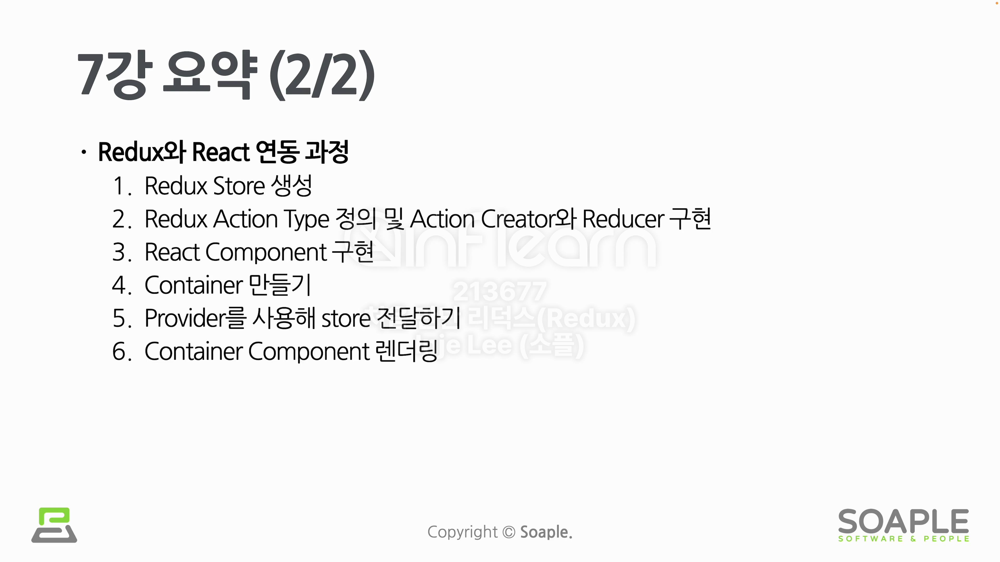

# Container

Container는 Redux를 React에 연동했을 떄 사용하는 개념이다. Redux에서의 Container는 Redux와 연결되어 있는 React의 컴포넌트를 의미한다. 연결은 실제 `connect()` 라는 함수를 이용한다. 여기서 중요한 점은 컴포넌트를 Import할 때 React의 컴포넌트가 아닌 connect 함수로 연결된 React-Redux의 컴포넌트로 Import 시켜서 사용해야 한다.

## Binding Library

Binding Library는 어떤 라이브러리를 특정 환경에서 사용하기 위해 그 환경과 라이브러리를 중간에서 묶어주는 역할을 하는 라이브러리이다. 대표적으로 `React Redux` 라이브러리가 있다. 즉, React와 바인딩하기 위한 Redux인 것이다.

## Provider

`React Redux`의 Provider Component는 하위 컴포넌트들이 Redux에 접근하기 위함이다. (Context API도 마찬가지다. Redux 또한 내부적으로는 Context API를 사용하기 때문.)

## mapStateToProps()

mapStateToProps()는 Redux State를 타겟 리액트 컴포넌트의 Props로 연결시켜주는 역할을 하는 함수이다. 여기서 중요한 점은 컴포넌트에서 꼭 필요한 State만 추출해서 전달해야 한다. 그 이유는 전달한 state가 바뀔 때마다 리렌더링이 되기 때문이다.

## mapDispatchToProps()

mapStateToProps()와 마찬가지로 mapDispatchToProps()의 리턴값을 리액트 컴포넌트의 Props로 연결시켜주는 역할을 한다.

## Redux와 React 연동 과정

## Duck

- Ducks Pattern
  - Redux의 수많은 구성요소들을 정리하는 하나의 규칙 패턴이다.
- Redux Reducer Bundle
  - 하나의 기능에 필요한 Action, Reducer, Action Creator, Side Effects를 모아놓은 것이다.
  - 각 파일을 Duck 파일이라고 부른다.
