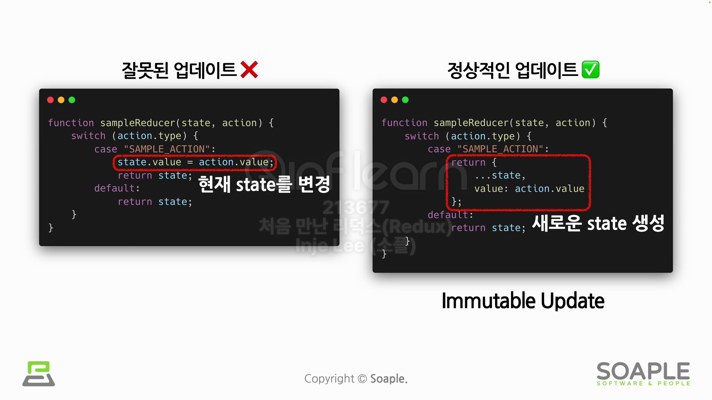

# Reducer

Reducer는 입력에 어떤 처리를 해서 원하는 결과를 축소시키는 과정이라는 의미를 갖고 있다. 실제로 Redux에서는 Reducer가 이러한 역할을 수행한다.

다시말해, Action이 발생하면 Action을 실제로 처리하는 역할을 함는 함수이고, Redux State에 변화를 주는 역할이라고 말할 수 있다.

```javascript
(state, action) => newState;
```

Reducer는 state와 action을 받아서 새로운 State를 반환한다. 이는 불변성의 원칙을 따라서 기존의 State를 변화시키는 것이 아닌 새로운 State를 반환하는 것이다.

## Reducer 규칙

- 새로운 State는 파라미터로 받은 현재 State와 Action 객체를 기반으로 생성해야 한다는 것이다.
  - 같은 입력값이 들어오면 항상 같은 결과를 보여준다.
- 현재 State를 조작할 수 없으며, 새로운 State를 만들어 불변하게 업데이트 시켜야 한다는 것이다.
- 비동기 로직이나 사이드 이펙트는 허용하지 않는다는 것이다. 즉, Reducer 내에서 서버와 통신을 해서 데이터를 받아오는 등의 로직을 사용하면 안된다.

## Immutable Update



위 그림과 같이 Reducer는 항상 새로운 State를 반환해야 하기 때문에 오른쪽처럼 새로운 State를 생성해야 한다. 그래서 최종적으로는 이러한 객체 생성을 손쉽게 도와주는 Redux Toolkit을 자주 사용하게 될 것이다.

## combineReducers()

combineReducers 함수는 여러 Reducer들을 하나로 합치는 함수이며, 해당 반환값은 RootReducer가 된다.
