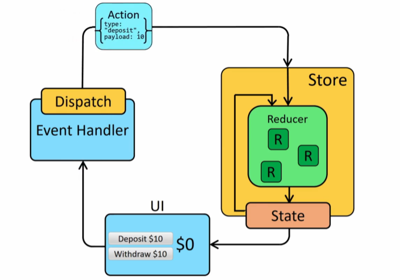

# Redux 구성요소

#### Store

Redux Store는 Redux의 데이터들을 저장하기 위한 저장소라고 보면 된다.

#### State

Redux State는 React의 State와 동일하게 Redux Store에 저장되어 있는 데이터를 말한다.

#### Action

Redux Action은 어떠한 행동으로, Redux State에 변화를 주기 위한 행동이라고 보면 된다. (Redux Action은 자바스크립트의 객체 형태로 존재한다.)

#### Action Creater

Action Creater는 Action 객체를 생성하는 역할을 하는 함수이다.

#### Reducer

Reducer는 입력에 어떤 처리를 해서 원하는 결과로 축소시키는 과정을 말할 수 있다. 또한 Reducer는 Action이 발생하면 Action을 실제로 처리하는 역할을 하는 함수이다.

- UI에서 이벤트를 발생시키면 Redux Action이 발생하게 된다.
- 해당 Action을 Reducer가 처리하게 된다.
- 그 과정에서 State에 변화가 생기게 된다.
