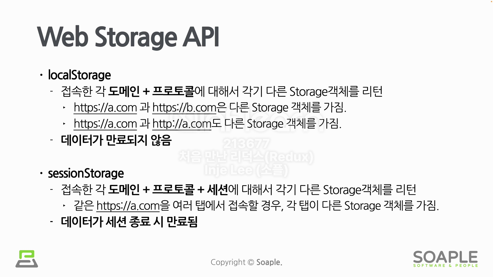
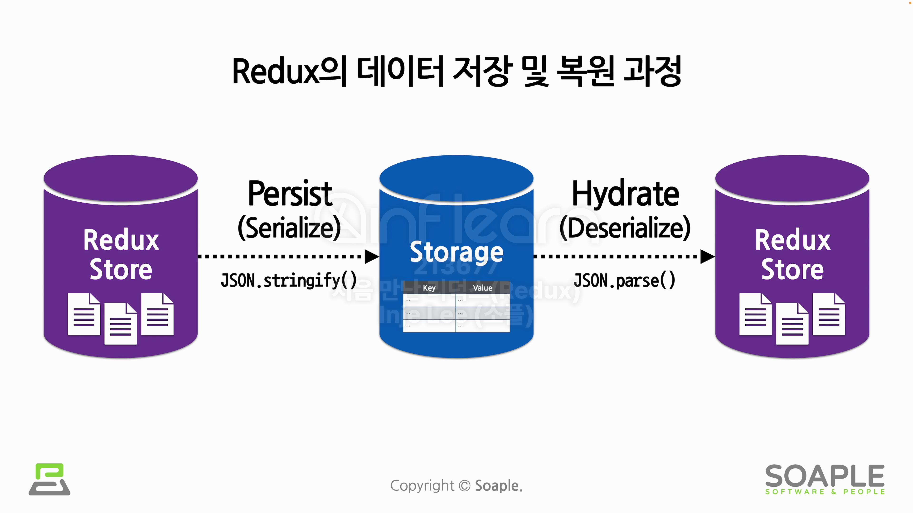
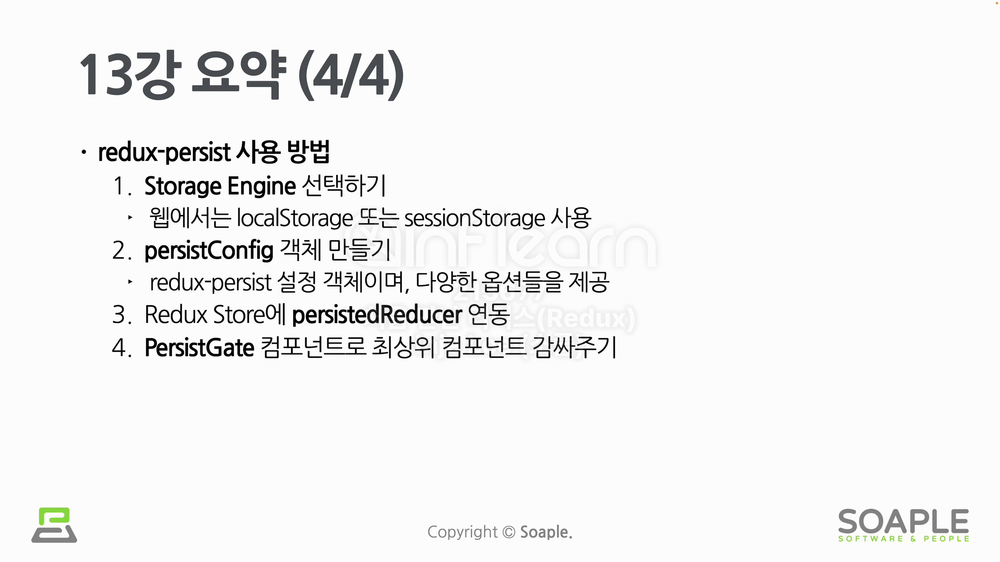

# Redux Persist

Persist는 상태를 저장장치에 저장함으로써, 프로세스가 재시작되어도 다시 상태를 복원 가능하다.

## redux-persist

redux-persist 라이브러리는 Redux Store의 데이터를 유지시키고 다시 복원해주는 역할을 수행한다. (앞서 redux-persist를 사용하지 않으면 Redux Store는 브라우저 새로고침시 사라진다고 했다.)

redux-persist를 사용할 때는 꼭 저장이 필요한 데이터만 whitelist에 넣어서 사용해야 한다.

## Web Storage API

## 데이터 저장 및 복원 과정

## Redux Persist 사용

