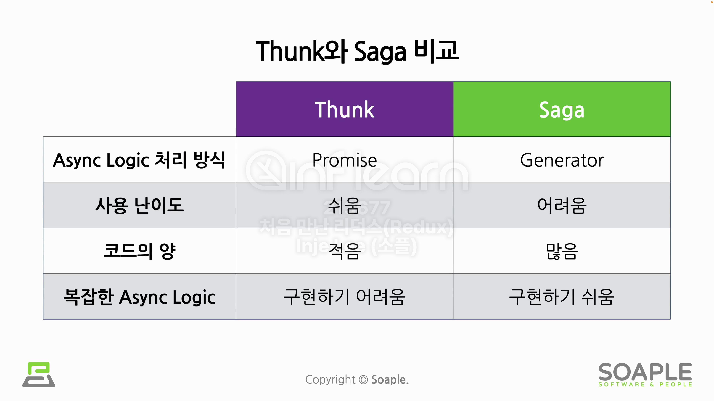

# Redux Saga

Saga의 사전적 의미는 영웅 전설, 일련의 사건으로 게임에서 많이 사용되는 용어이다. 프로그래밍에서는 하나의 매커니즘으로 분산된 트랜잭션을 사용하여 긴 프로세스를 관리하는 방법이다. 또한 Redux에서의 Saga는 Side Effect를 활용하여 단방향 데이터 흐름을 관리하는 방법이라 할 수 있다.

## redux-saga

redux-saga는 내부적으로 Generator Function을 사용한다.

- Redux에서 Side Effect를 펀하고 직관적으로 사용할 수 있게 해주는 라이브러리
- Effect를 선언하는 형태로 Side Effect를 사용
  - Effect는 Generator로부터 yield된 JavaScript 객체를 의미
- 다양한 Effect Creators
  - take, takeEvery, takeLatest, takeLeading, put, call, select 등
- Actino을 Dispatch 하기 위해서는 put() 함수 사용

- 규모가 크고, 복잡한 Async Logic 일수록 -> Saga
- 규모가 작고, 단순한 Async Logic 일수록 -> Thunk
