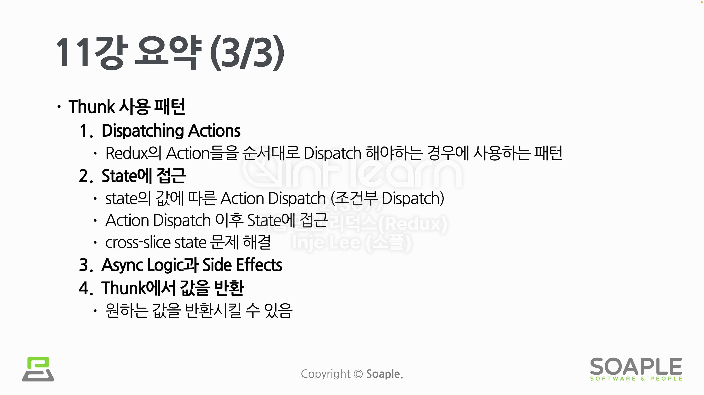

# Redux Thunk

Thunk의 사전적 의미는 일부 지연된 작업을 수행하는 코드 조각이라는 뜻이다. 프로그래밍에서의 Redux Thunk는 Redux Store의 dispatch 및 getState() 함수와 상호작용 할 수 있는 로직을 갖고 있는 함수 작성 패턴이다. 쉽게 말해 Redux Store와 상호작용하는 함수이다.

Redux Thunk를 사용해야하는 대표적인 이유는 Async Logic과 Side Effects를 사용하기 위함이다.

## redux-thunk

redux-thunk는 Redux middleware인 thunk를 쉽게 사용하기 위한 라이브러리이다.

