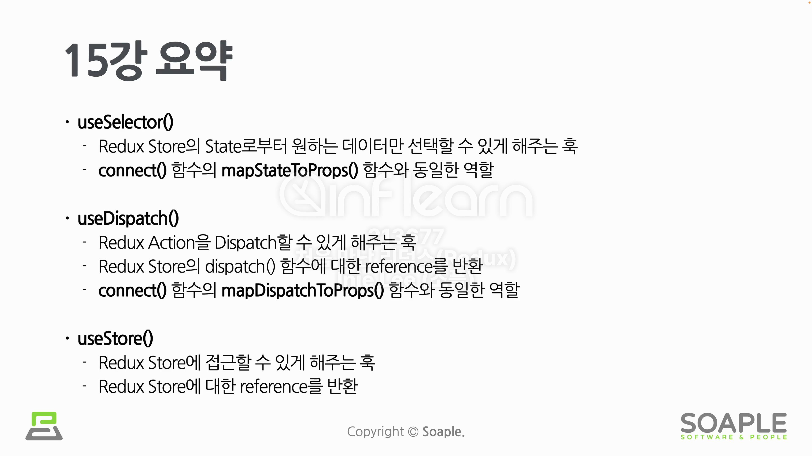

# Redux Toolkit

Redux Toolkit은 효율적인 Redux 개발을 위한 공식 도구 모음이다. Redux Toolkit 내부에 이미 Redux와 관련된 수많은 도구들이 포함되어 있다. 현재는 Redux를 사용한다면 Redux Toolkit을 기본 표준으로 사용한다. 즉, Redux Toolkit은 Redux를 조금 더 쉽게 사용할 수 있게 하기 위함이다.

## Redux Toolkit 등장 배경

- Redux Store를 생성하는 과정이 너무 복잡함
- Redux를 제대로 사용하려면 설치해야 할 패키지가 너무 많음
  - immer.js
  - redux-thunk
  - ...
- Redux는 기본적으로 작성해야 할 비슷한 코드의 양이 너무 많음
- Actions, Action Creator
- Reducers
- Thunks
- ...

## slice

slice는 Redux 구성요소들의 조각이다. Redux 구성요소는 Action Types, Action Creators, Reducers 등이며, 이들을 자동으로 생성해준다. 즉, slice의 객체의 기능들을 그냥 가져다가 사용하기만 하면 된다.

## Redux Toolkit 주요 API

- configureStore(): Redux Store를 편리하게 사용.(createStore 대신 사용)
- createAction(): Action Creator 반환
- createReducer(): Reducer 생성
- createSlice(): slice 생성
- createAsyncThunk(): 비동기 로직 처리
- current(): 현재 State 값 반환

## Redux Hook

- useStore 훅은 최대한 사용을 지양해야 한다.
- 대신에 useSelector를 사용하여 원하는 데이터만 가져오도록 한다.
