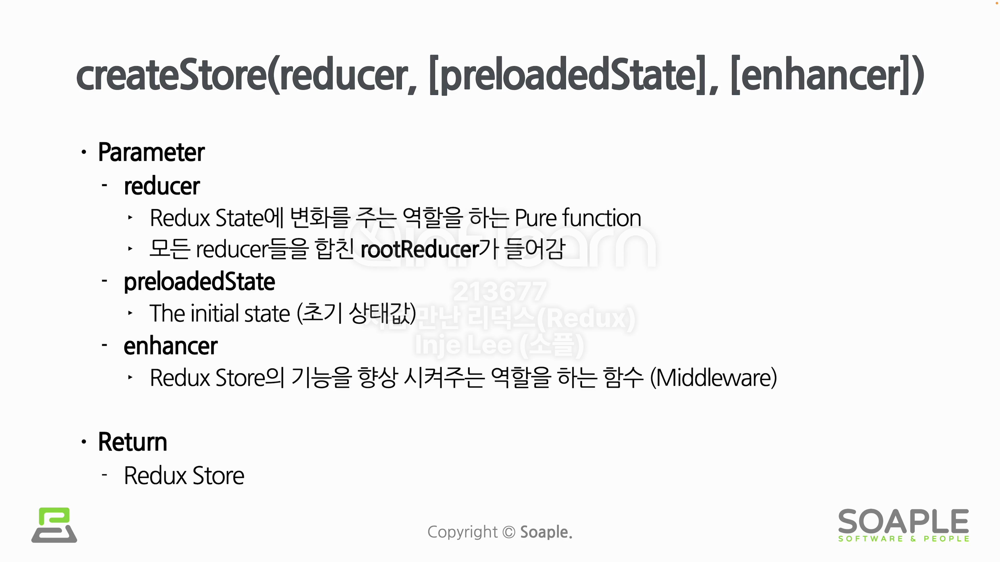
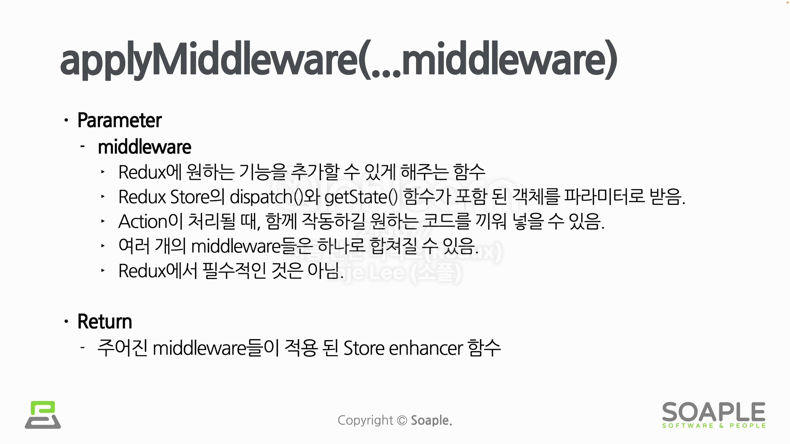

# Redux Store

Redux Store는 Redux의 데이터들을 저장하기 위한 저장소이다. 하지만 실제로 저장장치에 저장하는 것은 아니다. 즉, DB처럼 영구성(Persistence)으로 저장하는 것이 아닌 Redux 데이터들을 관리하기 위함이다. 즉, 브라우저 새로고침을 하면 Redux Store의 모든 데이터는 사라진다. (데이터가 메모리에 있기 때문!)

## Dispatcher

Dispatch는 발송하다, 파견하다의 의미로, Dispatcher는 발송하는 역할을 하는 것이다. 즉, Action을 발송하는 역할을 수행한다. (Action이 발생했다는 것을 Redux에 알리는 것이다.) 그리고 Action을 받아서 실제로 변화를 주는 것이 바로 Reducer이다.

```javascript
store.dispatch(action); // Action을 발송
```

## createStore



## applyMiddleware



## getState

Redux의 모든 상태값을 불러올 수 있다.
