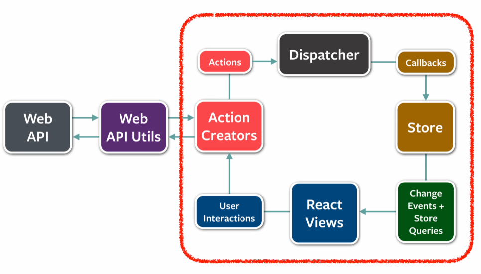

# 리덕스(Redux)

많은 웹서비스를 SPA로 개발하면서 규모가 증가하면서 상태관리 역시 점점 복잡도가 증가하여 관리하기 힘들어진다. 즉, 언제 어디서 어떻게 상태가 업데이트 되는지 파악하기가 힘들어졌다. 그래서 수많은 상태들을 효과적으로 관리하기 위해 등장하게된 상태관리 라이브러리가 바로 리덕스이다.

> Redux는 내부적으로 Context API를 사용하고 있다. 다만 Redux는 하나의 Store에 정해진 방법으로만 데이터를 관리하지만, Context API는 데이터를 관리하지 않으며, state를 전달하기 위한 통로의 역할만 한다.

## Flux Architecture

리덕스는 Flux Architecture 라는 인터페이스를 구현한 구현체이다. Flux Architecture는 단방향 데이터 흐름을 활용한 리액트용 애플리케이션 아키텍처를 말한다. 그림과 같이 빨간색 부분이 Flux 구조이다.

## 리덕스의 3가지 원칙

- 단 하나의 진실의 원천
  - 리덕스의 모든 상태들은 `Redux Store`에 저장되는데 이 `Redux Store`가 바로 단 하나의 진실의 원천이 된다.
- 상태값은 읽기 전용
  - 리덕스에서의 상태값은 변경할 수 없고, 오직 읽기 전용(Readonly)이다.
- 변화는 순수(Pure) 함수들을 통해 이뤄져야 한다.
  - 입력값을 변경하지 않으며, 같은 입력값에 대해서는 항상 같은 출력값을 리턴한다.
  - 리액트의 Reducer 함수 역시 Pure 함수들이어야 한다.

State는 읽기 전용이며, State를 변화시키기 위해서는 새로운 State 객체를 생성해야 한다. 이러한 특징을 불변성(Immutability)라 하며, Redux State 생성 후에는 값을 바꿀 수 없다.

> Redux Toolkit은 내부적으로 불변성을 잘 지키기 위해 immer라는 라이브러리를 사용하고 있다.

## 리덕스를 사용해야하는 경우

- 하나의 상태를 여러 컴포넌트에서 접근해야 할 경우
- 한 곳에서 상태들을 관리하고 싶을 경우
  - 다만 모든 상태들을 Redux Store에서 관리하는 것은 위험하기 떄문에 꼭 필요한 State들만 관리할 필요가 있다.
