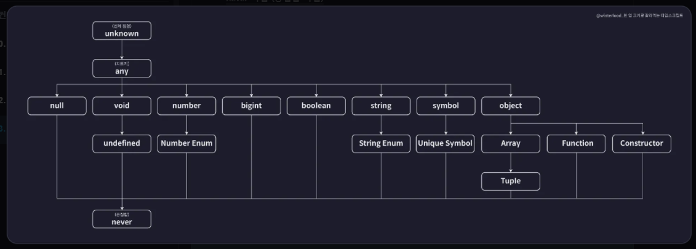

# 타입 계층도

위 사진은 타입 계층도를 나타내며, 최상위 타입은 unknown 타입이다. 이 말은 unknown 밑에 있는 다른 타입들이 모두 업캐스팅이 가능하다. 즉, unknown 타입은 어떠한 값으로도 할당할 수 있다는 의미이다.

이처럼 타입 계층도는 부모-자식 간의 타입 관계를 나타내며, 업캐스팅이 가능하여야 할당이 가능하며 다운캐스팅 해야한다면 해당 Type이 자식 타입인지 확인해야 한다. (그렇다고 위 사진에 있는 타입 계층도를 외우려고 하지 말자!)
