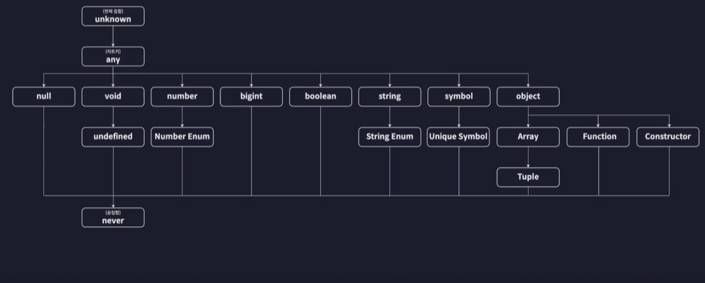

# 타입들

TypeScript에서 어떤 타입들이 있는지 알아보자.



TypeScript에서 타입들은 부모-자식 관계의 계층형 관계를 갖는다.

## 원시 타입

원시 타입(Primitive Type)은 하나의 값만 저장하는 타입이다.

| 변수 타입 뒤에 정의하는 타입을 Type Annotaion이라 한다.

```javascript
// number
// 정수, 소수점, Infinity, -Infinity, NaN
let num1: number = 123;

// string
// "", Template literal
let str1: string = "Hello TypeScript!";

// boolean
// true, false
let bool1: boolean = true;

// null
// null 이외의 값은 할당 불가
let null1: null = null;

// undefined
// undefined 이외의 값은 할당 불가
let undefined1: undefined = undefined;

// 리터럴 타입
// 리터럴 값으로 정의한 값만 할당 가능
let numA: 10 = 10;
// numA = 12 Compile Error
```

만약 number 타입인데 null을 할당하고 싶을 때는 tsconfig.json 파일에 `strictNullCheck=false` 옵션을 주면 된다. 하지만 엄격하게 한다면 그냥 `true` 두는 것도 나쁘지 않다.

## 배열과 튜플

### 배열

```javascript
// 배열
// number[]: 숫자 타입만 담을 수 있다.
let numArr: number[] = [1, 2, 3];

let strArr: string[] = ["123", "Hello", "TypeScript"];

// 제네릭 사용 (자바에서 익숙..)
let boolArr: Array<boolean> = [true, false];

// 배열에 들어가는 요소들의 타입이 다양할 경우
let multiArr: (number | string)[] = [1, "hello"];

// 다차원 배열
let doubleArr: number[][] = [
  [1, 2],
  [3, 4],
];
```

### 튜플

튜플은 JavaScript에는 없지만 TypeScript에서 제공된다. 사실 튜플은 새로운 자료구조라 보기는 어렵고, 그냥 배열이라 생각하면 된다. 다만 배열의 길이와 순서에 맞는 타입이 중요할 때 튜플을 사용하면 좋다.

```javascript
// 튜플
// 길이와 타입이 고정된 배열
let tup1: [number, number] = [1, 2];

let tup2: [number, string, boolean] = [1, "2", true];

const users: [string, number][] = [
  ["Mike", 1],
  ["James", 2],
];
```

## 객체

```javascript
// object -> 객체 리터럴 타입
let user: { id?: number; name: string } = {
  id: 1,
  name: "Mike",
};

let config: {
  readonly apiKey: string
} = {
  apiKey: "MY API KEY"
}
// config.apiKey = "변경할 KEY" Compile Error!
```

- 위와 같이 구조를 기준으로 한 타입을 구조적 타입 시스템이라 하며, Property Based Type System 이라 한다.
- 이와 반대로 이름만을 기준으로 한 타입을 명목적 타입 시스템이라 한다.
- TypeScript는 구조적 타입 시스템이다.
- `id` 뒤에 `?`는 id Property가 있어도 되고, 없어도 된다. 즉, 선택적(Optional) 프로퍼티라 한다.
- `readonly`를 사용하면 apiKey의 값을 변경하지 못한다.

## 타입 별칭

위에서 객체 타입에 프로퍼티마다 타입을 정해주어야 했는데 가독성이 떨어지는데 타입 별칭을 쓰면 해결할 수 있다.

```javascript
// 타입 별칭
type User = {
  id: number,
  name: string,
};
let user: User = {
  id: 1,
  name: "Mike",
};
```

## 인덱스 시그니처

```javascript
// 인덱스 시그니처
// key와 value의 규칙을 기준으로 객체의 타입을 정의
type CountryCodes = {
  [key: string]: string,
};
let countryCodes: CountryCodes = {
  Korea: "ko",
  UnitedState: "us",
};
```

- Key와 value에 규칙만 정하면 정해진 타입대로 프로퍼티와 값을 추가하면 된다.
- 타입 별칭과은 모든 프로퍼티와 값을 추가했지만 인덱스 시그니처는 규칙만 정해준 것이다.

## Enum 타입

JavaScript에는 없지만 TypeScript에서는 지원하는 새로운 타입이다. (자바에서 Enum 생각해보자.)

```javascript
// enum 타입
// 여러가지 값들에 각각 이름을 부여해 열거해두고 사용하는 타입
enum Role {
  ADMIN = 0,
  GUEST = 1,
}

const user1 = {
  name: "Mike",
  role: Role.ADMIN, // 0 <- 관리자
};

const user2 = {
  name: "James",
  role: Role.GUEST, // 1 <- 게스트
};
```

- 위 코드와 같이 리터럴 값으로 할당하지 않고, Enum으로 만들어서 해당 타입으로 접근하므로 Type-Safe 하다고 할 수 있다.

## Any, Unknown 타입

### Any

어떤 타입인지 정확히 모를 때 사용한다.

```javascript
// any
// 특정 변수의 타입을 확실히 모를 때 사용
let anyVar: any = 10;
anyVar = "Hello";
```

- 원래는 TypeScript가 타입을 추론하여 에러를 발생시키지면 any 타입을 선언하면 다른 타입으로도 값을 할당할 수 있다.
- any 타입의 최대 단점은 타입을 철저히 무시하기 때문에 런타임 때 에러가 발생할 수 있으므로 최대한 사용하지 말아야 한다.

### Unknown

Unknown 타입은 any와 비슷하다

```javascript
// unknown
let unknownVar: unknown = 10;
// let num: number = unknownVar; Error!
```

- 다만 Unknown 타입은 다른 변수에 할당할 수 있다.
- 그래서 조건문에서 활용할 수 있고, any 타입을 사용한다면 적어도 Unknown 타입이 안전하다

## Void와 Never

### void

void는 반환하는 타입이 없음을 의미한다. 주로 함수에 사용한다.

```javascript
// void
// 아무것도 없음을 의미하는 타입
// 반환하는 타입이 없다.
function func1(): void {
  console.log("Hello");
}
```

### never

never는 불가능한 타입을 의미한다. 바로 예제를 보자.

```javascript
// never
// 불가능한 타입 (절대로 정상적으로 종료될 수 없는 상황)
function func2(): never {
  throw new Error();
}
```
