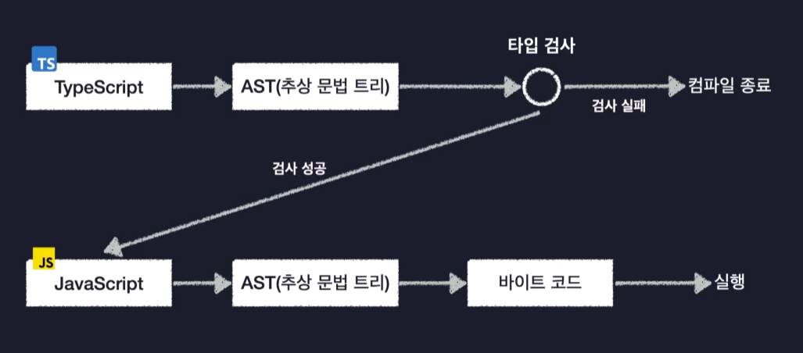

# 타입스크립트란?

타입스크립트(TypeScript)는 자바스크립트를 더 안전하게 사용할 수 있도록 타입 관련 기능들을 추가한 언어이다. 동적 타입 언어인 자바스크립트는 런타임 때 알 수 있어서 예상치 못한 버그를 만날 수 있지만 타입스크립트는 컴파일 타임에 알 수 있어서 좀 더 안전하게 코딩할 수 있다.

> 타입스크립트를 자바스크립트의 확장판이라 생각하면 된다.  
> 참고로 타입스크립트를 C# 언어 창시자가 만들었다는 사실을 듣고 놀랐다..

- 자바스크립트는 동적 타입 언어인 만큼 유연하게 코드를 작성할 수 있지만 개발자가 이를 인지하지 못하고 실수하게 되면 실행시 에러가 발생하여 기능이 제대로 동작하지 못하는 상황이 발생한다. 만약 혼자 개발한다면 혼자서 다 고치면 되지만 10명, 20명, 100명.. 된다면 어떻게 유지보수 할 수 있을까..?
- 타입스크립트는 코드를 작성할 때부터 타입이 맞지 않으면 컴파일 시점에 바로 에러를 발생시키기 때문에 좀 더 엄격하게 코드를 작성해야 한다. 따라서 유연하게 코드를 작성하지 못한다는 단점이 있지만 그만큼 엄격하게 작성하기 때문에 10명, 100명..등 여러명이서 유지보수하게 될 때 유리할 수 있다. 그리고 프로그램을 개발할 때는 어느정도 제약이 있어야 오히려 개발하기 수월하다.
- 타입스크립트는 동적 타입과 정적 타입을 모두 합친 언어이다. 즉, 변수에 일일이 타입을 지정해줄 필요가 없으며, 잘못된 타입의 메서드를 사용하면 바로 컴파일 에러를 발생시킨다. 이게 가능한 이유는 점진적 타입 시스템으로 타입스크립트가 알아서 타입을 추론한다.

## 컴파일 과정

JavaScript 언어는 컴파일되면 바이트코드로 변환되어 실행되는데 타입스크립트는 한 과정을 더 거치는데 바로 타입을 검사하는 과정이다.

위 그림을 보면 신기하게도 타입스크립트는 타입을 검사하고 바이트코드로 변환하는 것이 아닌 바로 JavaScript를 변환한다.
